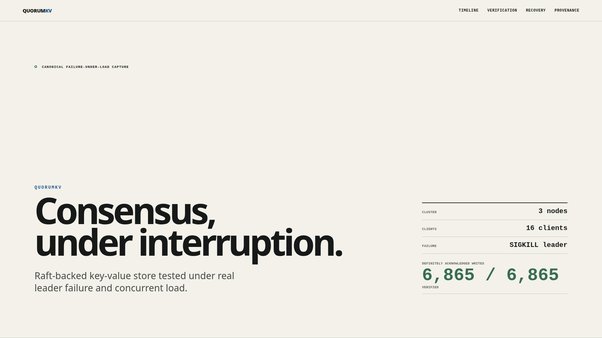

# QuorumKV

QuorumKV is a Raft-backed distributed key-value store built from scratch to
study consensus, persistence, replication, and failure recovery using real OS
processes, TCP, and disk-backed state. Raft is implemented here without an
external consensus library.

[Project showcase](https://nhatminh06.github.io/quorumkv/) ·
[Canonical failover evidence](docs/evidence/canonical/) ·
[Architecture](docs/architecture.md) ·
[Demo video](https://github.com/nhatminh06/quorumkv/releases/download/portfolio-v1/quorumkv-demo.mp4)

[](https://nhatminh06.github.io/quorumkv/)

## What QuorumKV demonstrates

- A persistent Raft implementation with PreVote elections, replicated logs,
  commit tracking, and crash recovery.
- Real node and client executables communicating over bounded binary protocols
  on TCP—not an in-process-only simulation.
- Quorum-confirmed linearizable reads through `ReadIndex`.
- At-most-once state-machine effects for retried writes through replicated
  request identity and deduplication.
- Snapshot creation and chunked `InstallSnapshot` follower recovery.
- Joint-consensus membership changes and deliberate leadership transfer.
- Checksummed, append-oriented persistent formats with torn-write recovery.

The project is an engineering study, not a production-ready database service.

## Canonical leader-failover result

The committed M25 capture ran three real QuorumKV processes with real TCP and
disk-backed state. Sixteen concurrent clients maintained a deterministic 70%
PUT / 30% GET workload while the current leader was killed with `SIGKILL`.

```text
LEADER FAILURE UNDER LOAD

initial             node 1 leader · term 1
failure             SIGKILL node 1
replacement         node 2 leader · term 2

before crash        3,621 acknowledged writes
after failover      3,244 acknowledged writes
total               6,865 acknowledged
verified            6,865
missing             0
```

No definitely acknowledged write was missing in this captured run. The
surviving quorum continued committing new writes after leadership changed.
The failed node then restarted from its existing data directory and caught up
through normal replication.

Final convergence:

```text
node 1              follower
node 2              leader
node 3              follower
term                2
commit / applied    6867 / 6867
apply lag           0
membership          3 voters
```

The fixed canonical run also recorded:

```text
STALE_REQUEST       0
REQUEST_CONFLICT    0
unexpected errors  0
```

These are observations from one captured execution, not a claim that every
future execution can never produce an ambiguous or transient outcome. Inspect
the [interactive incident timeline](https://nhatminh06.github.io/quorumkv/)
or the [canonical JSON and checksums](docs/evidence/canonical/).

### What failure-under-load testing found

Stress testing exposed a real deduplication race on replacement leaders:
committed state could exist in the Raft log before the new leader's state
machine had applied it, causing a legitimate next client sequence to be
classified as stale.

The [fix](https://github.com/nhatminh06/quorumkv/commit/f3ff0bfd41c8fb0d2bca3864af96f8dd85b130bd)
establishes the necessary current-term commit/apply barrier before the
leader-local dedup lookup and atomically reserves same-identity pending
requests. The Pages report contains the concise causal chain.

## Architecture

```text
Clients
   │
   ▼
Service
   ├─ request identity / dedup
   ├─ ReadIndex
   └─ proposal path
   │
   ▼
Raft
   ├─ elections
   ├─ replication
   ├─ snapshots
   └─ membership
   │
   ▼
Persistent state
   │
   ▼
KV state machine
```

See [Architecture](docs/architecture.md) for the complete process model,
write/read paths, persistence design, and operational control plane.

## Correctness properties

- **Leader election with PreVote** avoids disruptive term changes from an
  isolated node.
- **Persistent replicated log** retains term, vote, log, and commit state
  across process restarts.
- **Linearizable GET** uses quorum-confirmed `ReadIndex` and local apply
  catch-up rather than follower reads.
- **Replicated request deduplication** preserves request identity across
  retries and leader changes.
- **Snapshots / `InstallSnapshot`** recover followers behind a compacted log.
- **Joint consensus** requires majorities of both configurations during a
  membership transition.
- **Same-disk crash recovery** is exercised through actual subprocess kills
  and restarts.

These mechanisms are tested, not formally verified. Their invariants and test
matrices are linked from [Documentation](#documentation).

## Historical measured performance studies

These measurements predate and are separate from the canonical M25 failover
capture. They are single-machine studies; do not extrapolate them to other
hardware.

| Study | Before | After | Result |
|---|---:|---:|---:|
| 5,000-entry follower catch-up | 3.95 s | 0.27 s | ≈14.7× faster |
| 25,000-entry follower persistence | 1.036 s / 98.84× write amplification | 13–14 ms / 1.001× | append-oriented segments |

See [performance methodology](docs/performance.md),
[replication evidence](docs/replication-performance.md), and
[storage evidence](docs/raft-log-storage.md).

## Quick start

Requires Go 1.26.5 or newer.

```bash
git clone https://github.com/nhatminh06/quorumkv.git
cd quorumkv
make build
./scripts/start-local-cluster.sh

./bin/qkv --addr 127.0.0.1:7001 put x 1
./bin/qkv --addr 127.0.0.1:7001 get x
./bin/qkv --addr 127.0.0.1:7001 status

./scripts/stop-local-cluster.sh
```

The start script launches a real three-node cluster on ports 7001–7003 and
waits for election. See [Operations](docs/operations.md) for direct node
startup, data-directory semantics, metrics, and administrative commands.

## Evidence and testing

```bash
gofmt -l .
go vet ./...
go build ./...
go test ./...
go test -race ./...
make check
python3 tools/demo/validate.py docs/evidence/canonical
```

Mandatory process-level tests build and spawn the real `quorumkv` and `qkv`
binaries over TCP with temporary persistent directories. The canonical bundle
adds a sanitized, checksum-verified record of the leader-failure-under-load
scenario. Ambiguous outcomes are excluded from the definitely acknowledged
set and tracked separately.

The [recording guide](docs/recording.md) documents the deterministic silent
demo; it presents the existing evidence and never recaptures it.

## Limits of claim

- Crash-fault model only; no Byzantine tolerance or network-partition claim.
- One local-loopback canonical run; not a production SLO, failover guarantee,
  throughput benchmark, or cross-region study.
- No formal verification.
- No TLS or authentication; intended for local or trusted-network study.
- No sharding, multi-Raft, transactions, CAS, TTL, follower leases, automatic
  discovery, or Kubernetes deployment.
- Client identities are not persisted by the one-shot CLI, the dedup table has
  no garbage collection, and snapshot creation is manually triggered.
- Corrupted persistent storage is replaced through membership procedures; it
  is not repaired in place.

## Documentation

- [Architecture](docs/architecture.md)
- [Raft election](docs/raft-election.md) and [log replication](docs/raft-log-replication.md)
- [ReadIndex](docs/read-index.md) and [request deduplication](docs/request-dedup.md)
- [Snapshots](docs/snapshots.md), [membership](docs/membership.md), and [leadership transfer](docs/leadership-transfer.md)
- [Persistence](docs/wal.md), [crash consistency](docs/crash-consistency.md), and [state machine](docs/state-machine.md)
- [Operations](docs/operations.md), [failure testing](docs/failure-testing.md), and [demos](docs/demo.md)
- [Observability](docs/observability.md) and [performance studies](docs/performance.md)

**Portfolio status: feature-frozen.** Future changes are limited to correctness
bug fixes, compatibility fixes, documentation corrections, and justified
evidence replacement.
