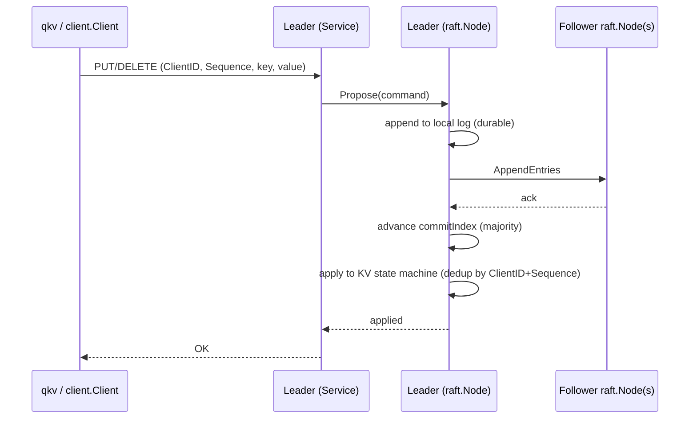

# Architecture

A portfolio-level overview of how QuorumKV fits together. Each section
links to the design document with the actual protocol detail and test
list — this page is meant to orient, not duplicate.

## 1. System overview

QuorumKV is a Raft-replicated key-value store. Every write is
proposed to a leader, replicated to a majority, committed, and applied
to a deterministic state machine on every node. Every read is either
served by the leader after confirming, via a quorum round trip, that it
is still recognized as leader (`ReadIndex`), or answered by the
observational (non-linearizable) status protocol used for operational
inspection.

```text
Client
  ↓
Leader
  ↓
Replicated Raft Log
  ↓
Committed Commands
  ↓
KV State Machine
```

## 2. Process model

Each node is one OS process (`quorumkv node`), owning one persistent
data directory and one TCP listener that carries three protocols
multiplexed by message type: Raft RPCs (`RequestVote`, `AppendEntries`,
`InstallSnapshot`, `TimeoutNow`), the client protocol (PUT/GET/DELETE),
and the admin protocol (status/snapshot/transfer/voter changes). There
is no separate control-plane port. See [transport.md](transport.md).

## 3. Client write path



A write carries a stable request identity (`ClientID` + a monotonic
per-client `Sequence`) so a client that never received the response to
a proposal it actually committed can safely resend it: the state
machine deduplicates by identity and applies the effect at most once,
even across a leader failover. See [request-dedup.md](request-dedup.md)
and [state-machine.md](state-machine.md).

## 4. Linearizable read path

GET carries no request identity — it is idempotent by nature. The
leader confirms it is still leader by contacting a quorum (`ReadIndex`)
before serving from local state, eliminating stale reads from an
isolated old leader. See [read-index.md](read-index.md).

## 5. Election path

Every node runs a randomized election timer. Before a real election, a
node runs a PreVote round — "would you vote for me?", touching no
persistent state — and only starts a real election if that reaches
quorum; a voter that recently heard from a healthy leader rejects the
hypothetical vote outright. This keeps an isolated, repeatedly-timing-
out node from bumping the cluster's term. See
[raft-election.md](raft-election.md).

## 6. Replication

The leader keeps one replication worker per peer, each tracking
`nextIndex`/`matchIndex` and driven by both a heartbeat interval and
event-driven wakeups (new entries, peer catching up) so a stale
follower doesn't wait for successive heartbeats to catch up. Follower
progress is guarded by a per-peer generation counter so a stale or
superseded RPC response can never regress progress already made. See
[raft-log-replication.md](raft-log-replication.md) and
[replication-performance.md](replication-performance.md).

## 7. Proposal batching and backpressure

Concurrent `Propose` calls on the leader can share one durable log
write instead of each paying for its own fsync. A full proposal queue
or a full service-level admission bound fails fast with a retryable
`BUSY` status instead of accepting unbounded work. See
[performance.md](performance.md).

## 8. Persistence model

Every persisted file uses an explicit, checksummed, bounds-validated
binary format — no `gob` or other opaque serialization for
correctness-critical state. Writes that must be durable before an
externally visible action (e.g. a vote) are fsynced first. Every
persisted file recovers as exactly its old content or exactly its new
content after a process killed at any point mid-write, proven with real
subprocess crashes. See [wal.md](wal.md) and
[crash-consistency.md](crash-consistency.md).

## 9. Snapshot and compaction

Snapshotting is caller-triggered (`qkv snapshot` / `Node.CreateSnapshot`)
— there is no automatic threshold or schedule. Once a snapshot exists,
the log below its boundary is compacted away; a follower that has
fallen behind that boundary catches up via `InstallSnapshot` instead of
replaying entries that no longer exist. See [snapshots.md](snapshots.md).

## 10. Request dedup

See section 3; full mechanism, the exact-next-sequence admission
policy, and the dedup table's lifetime (no GC yet — see Limitations) in
[request-dedup.md](request-dedup.md).

## 11. Membership changes

Adding or removing exactly one voter at a time, via joint consensus:
every quorum decision during the transition requires a majority of
*both* the old and the new configuration, never a majority of their
union. A node's persisted membership (not its startup `--peer` flags)
is always authoritative on restart. See [membership.md](membership.md).

## 12. PreVote

See section 5; [raft-election.md](raft-election.md) has the full
disruption-avoidance proof and test list.

## 13. Leadership transfer

A leader can hand off to a specific, fully caught-up voter: the target
is brought current (via ordinary replication or `InstallSnapshot`),
new write/read/membership admission freezes only once handoff begins,
and an authorized `TimeoutNow` triggers the target's election
(deliberately bypassing PreVote, since the current leader already
authorized it). Success is reported only once the old leader observes
real evidence the target won — never merely that `TimeoutNow` was
accepted. See [leadership-transfer.md](leadership-transfer.md).

## 14. Crash consistency

See section 8. Deterministic tests kill real subprocesses at each
meaningful point during a durable write and assert the file recovers to
exactly one of its two valid states. See
[crash-consistency.md](crash-consistency.md) and
[failure-testing.md](failure-testing.md).

## 15. Operational control plane

A separate, small admin wire protocol (status, snapshot,
transfer-leadership, add-voter, remove-voter) lets an operator inspect
and administer a node without reading its files directly. `status` is
explicitly non-linearizable observational metadata — it never runs
ReadIndex or touches term/log/commit/membership/timer state. Every
admin operation beyond status is a thin wrapper directly over the same
`raft.Node` methods used internally — see
[internal/service/admin.go](../internal/service/admin.go). This
protocol is unauthenticated and unencrypted, like the client protocol —
see Known limits below and [operations.md](operations.md). Full
CLI/runbook detail in [operations.md](operations.md).

## 16. Known limits

- Crash fault model only — not Byzantine fault tolerant.
- No TLS, no authentication, on either wire protocol.
- No client-side session persistence across a process restart (`qkv` is
  stateless per invocation).
- The write-dedup `ClientID` table has no GC/quota yet.
- Membership changes are one voter at a time; no batched changes, no
  learner/observer role as a public feature, no automatic rebalancing
  or discovery.
- Snapshot creation is manually triggered; no scheduling policy.
- No repair tooling for corrupted persistent storage — see
  [runbook-failover.md](runbook-failover.md#corrupted-node-storage).
- One TCP connection per RPC (no persistent connection pooling); no
  request pipelining across proposals beyond the batching in section 7.
- No sharding, no multi-Raft, no transactions, no CAS, no TTL, no
  follower reads, no leader leases.
